UML Diagram for C++ Design Pattern Examples
===

This project lists UML diagrams of the "[Design Pattern Examples in C++](https://github.com/takaakit/design-pattern-examples-in-cpp)". When you click on a diagram image, the diagram will be opened in **Diagram Map**. If you want to know about Diagram Map, see [this post](https://dev.to/takaakit/diagram-map-tracing-uml-sysml-elements-across-diagrams-49i7).

Behavioral Patterns
---
|  |  |  |
| :---: | :---: | :---: |
| **Chain of Responsibility** | **Command** | **Interpreter** |
| <a href="https://htmlpreview.github.io/?https://github.com/takaakit/uml-diagram-for-cpp-design-pattern-examples/blob/master/behavioral_patterns/chain_of_responsibility/DiagramMap.html">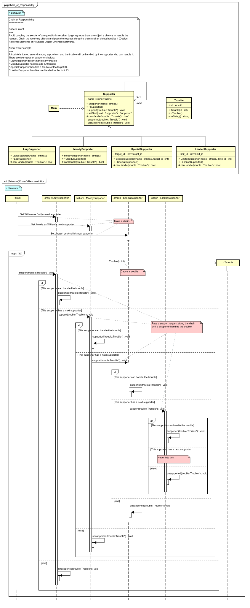</a><br><a href="https://github.com/takaakit/design-pattern-examples-in-cpp/tree/master/behavioral_patterns/chain_of_responsibility">C++ Code</a><br><a href="./behavioral_patterns/chain_of_responsibility/ExecutionResult.png">Execution Result</a> | <a href="https://htmlpreview.github.io/?https://github.com/takaakit/uml-diagram-for-cpp-design-pattern-examples/blob/master/behavioral_patterns/command/DiagramMap.html">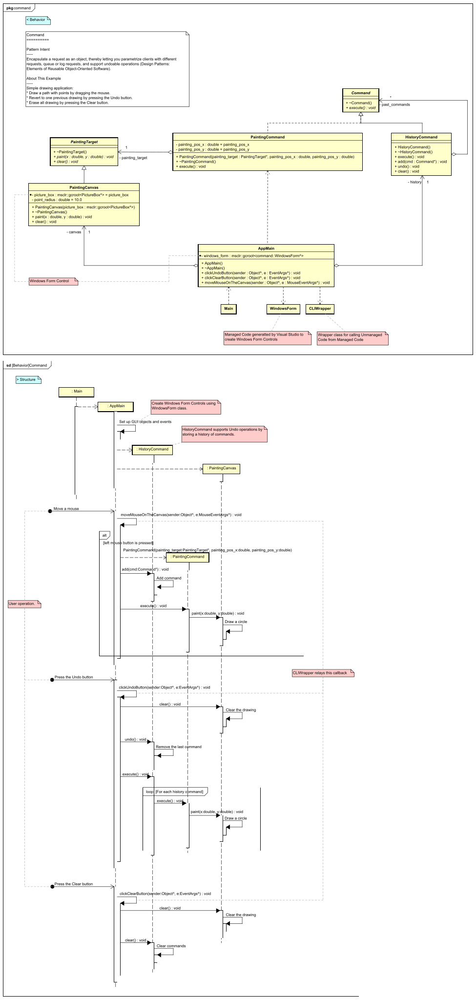</a><br><a href="https://github.com/takaakit/design-pattern-examples-in-cpp/tree/master/behavioral_patterns/command">C++ Code</a><br><a href="./behavioral_patterns/command/ExecutionResult.png">Execution Result</a> | <a href="https://htmlpreview.github.io/?https://github.com/takaakit/uml-diagram-for-cpp-design-pattern-examples/blob/master/behavioral_patterns/interpreter/DiagramMap.html">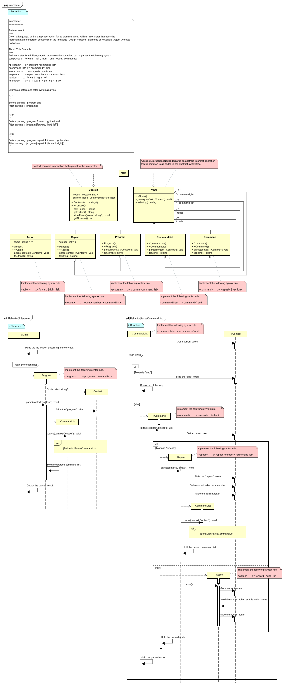</a><br><a href="https://github.com/takaakit/design-pattern-examples-in-cpp/tree/master/behavioral_patterns/interpreter">C++ Code</a><br><a href="./behavioral_patterns/interpreter/ExecutionResult.png">Execution Result</a> |
| **Iterator** | **Mediator** | **Memento** |
| <a href="https://htmlpreview.github.io/?https://github.com/takaakit/uml-diagram-for-cpp-design-pattern-examples/blob/master/behavioral_patterns/iterator/DiagramMap.html">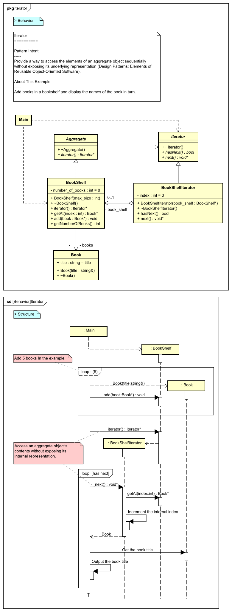</a><br><a href="https://github.com/takaakit/design-pattern-examples-in-cpp/tree/master/behavioral_patterns/iterator">C++ Code</a><br><a href="./behavioral_patterns/iterator/ExecutionResult.png">Execution Result</a> | <a href="https://htmlpreview.github.io/?https://github.com/takaakit/uml-diagram-for-cpp-design-pattern-examples/blob/master/behavioral_patterns/mediator/DiagramMap.html">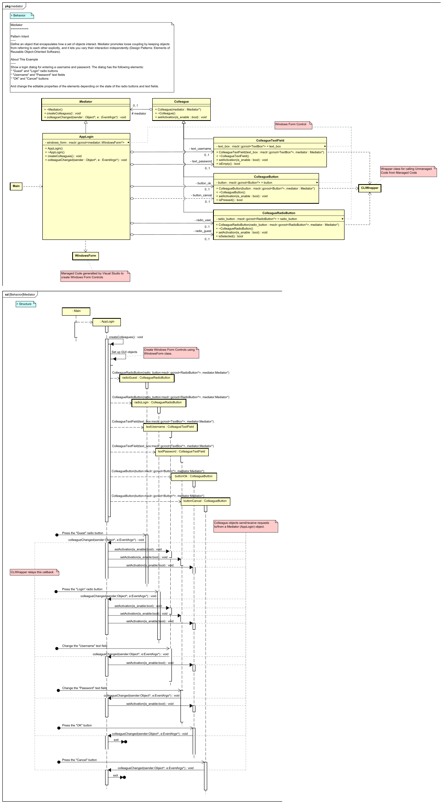</a><br><a href="https://github.com/takaakit/design-pattern-examples-in-cpp/tree/master/behavioral_patterns/mediator">C++ Code</a><br><a href="./behavioral_patterns/mediator/ExecutionResult.png">Execution Result</a> | <a href="https://htmlpreview.github.io/?https://github.com/takaakit/uml-diagram-for-cpp-design-pattern-examples/blob/master/behavioral_patterns/memento/DiagramMap.html">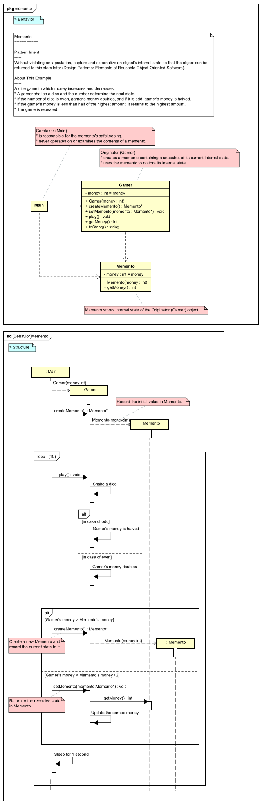</a><br><a href="https://github.com/takaakit/design-pattern-examples-in-cpp/tree/master/behavioral_patterns/memento">C++ Code</a><br><a href="./behavioral_patterns/memento/ExecutionResult.png">Execution Result</a> |
| **Observer** | **State** | **Strategy** |
| <a href="https://htmlpreview.github.io/?https://github.com/takaakit/uml-diagram-for-cpp-design-pattern-examples/blob/master/behavioral_patterns/observer/DiagramMap.html">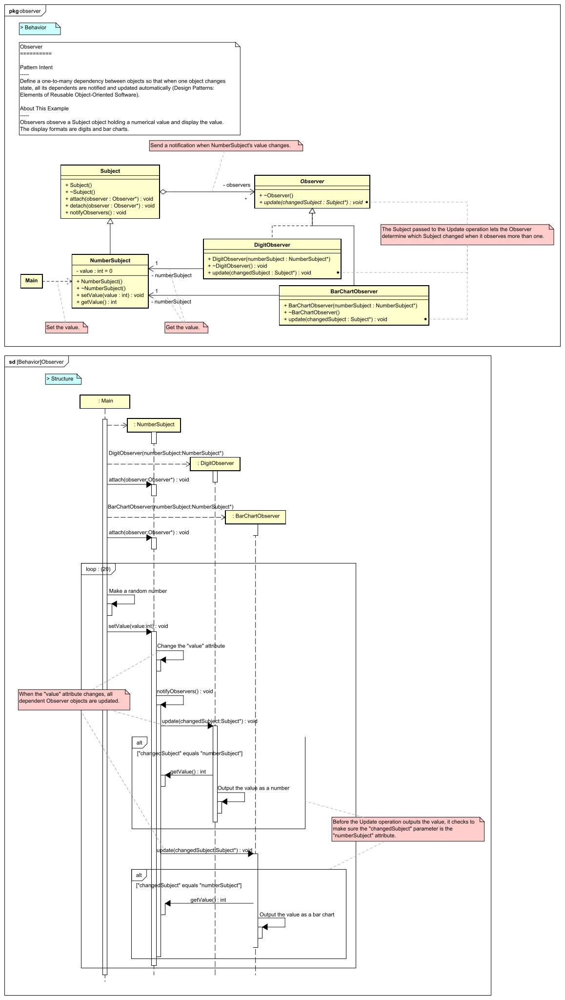</a><br><a href="https://github.com/takaakit/design-pattern-examples-in-cpp/tree/master/behavioral_patterns/observer">C++ Code</a><br><a href="./behavioral_patterns/observer/ExecutionResult.png">Execution Result</a> | <a href="https://htmlpreview.github.io/?https://github.com/takaakit/uml-diagram-for-cpp-design-pattern-examples/blob/master/behavioral_patterns/state/DiagramMap.html">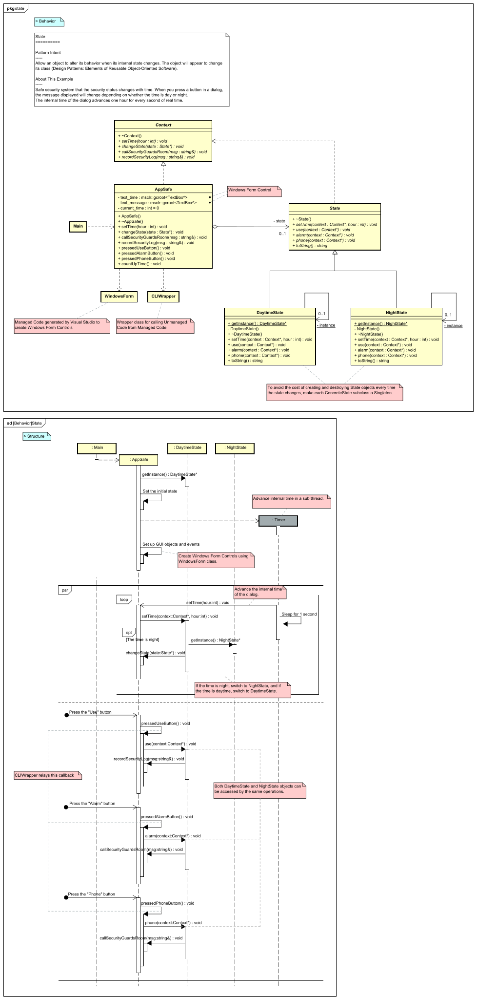</a><br><a href="https://github.com/takaakit/design-pattern-examples-in-cpp/tree/master/behavioral_patterns/state">C++ Code</a><br><a href="./behavioral_patterns/state/ExecutionResult.png">Execution Result</a> | <a href="https://htmlpreview.github.io/?https://github.com/takaakit/uml-diagram-for-cpp-design-pattern-examples/blob/master/behavioral_patterns/strategy/DiagramMap.html">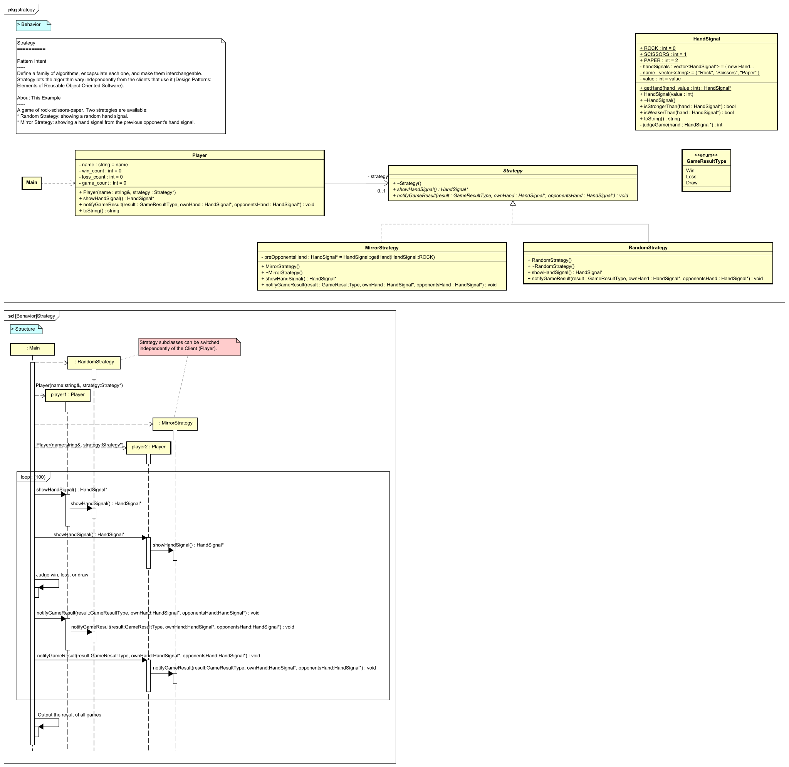</a><br><a href="https://github.com/takaakit/design-pattern-examples-in-cpp/tree/master/behavioral_patterns/strategy">C++ Code</a><br><a href="./behavioral_patterns/strategy/ExecutionResult.png">Execution Result</a> |
| **Template Method** | **Visitor** |  |
| <a href="https://htmlpreview.github.io/?https://github.com/takaakit/uml-diagram-for-cpp-design-pattern-examples/blob/master/behavioral_patterns/template_method/DiagramMap.html">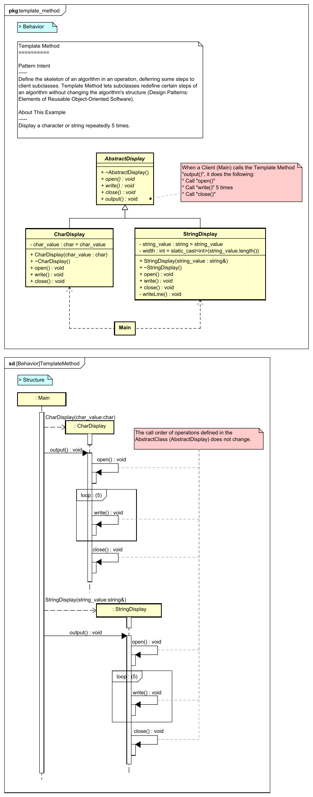</a><br><a href="https://github.com/takaakit/design-pattern-examples-in-cpp/tree/master/behavioral_patterns/template_method">C++ Code</a><br><a href="./behavioral_patterns/template_method/ExecutionResult.png">Execution Result</a> | <a href="https://htmlpreview.github.io/?https://github.com/takaakit/uml-diagram-for-cpp-design-pattern-examples/blob/master/behavioral_patterns/visitor/DiagramMap.html">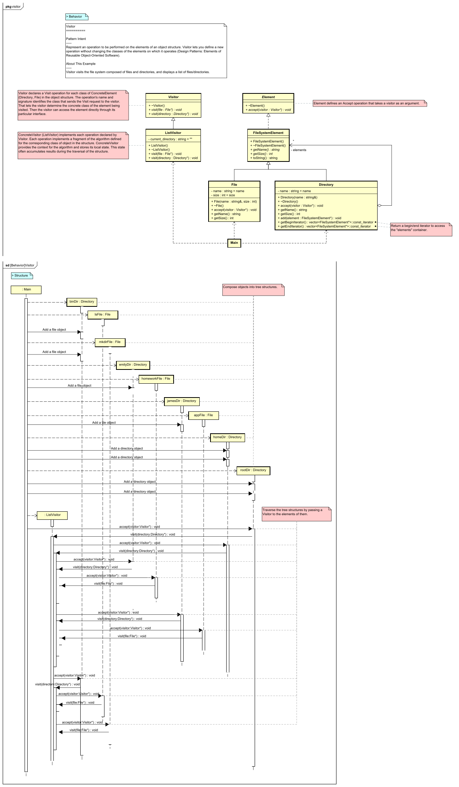</a><br><a href="https://github.com/takaakit/design-pattern-examples-in-cpp/tree/master/behavioral_patterns/visitor">C++ Code</a><br><a href="./behavioral_patterns/visitor/ExecutionResult.png">Execution Result</a> |  |

Creational Patterns
---
|  |  |  |
| :---: | :---: | :---: |
| **Abstract Factory** | **Builder** | **Factory Method** |
| <a href="https://htmlpreview.github.io/?https://github.com/takaakit/uml-diagram-for-cpp-design-pattern-examples/blob/master/creational_patterns/abstract_factory/DiagramMap.html">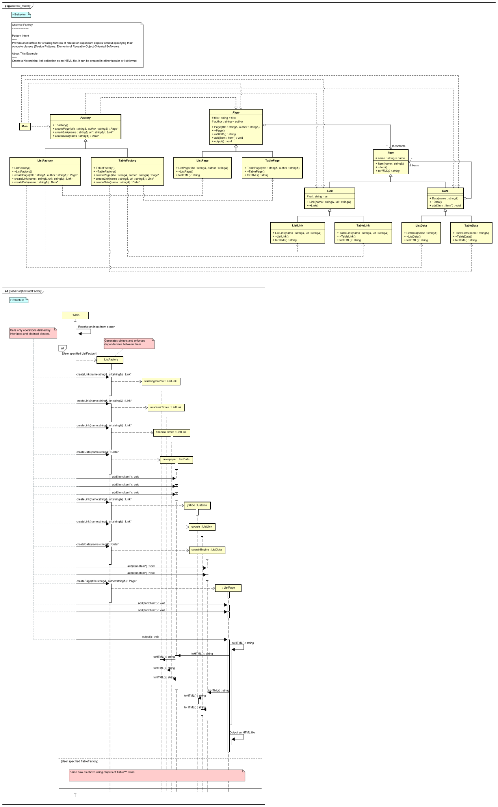</a><br><a href="https://github.com/takaakit/design-pattern-examples-in-cpp/tree/master/creational_patterns/abstract_factory">C++ Code</a><br><a href="./creational_patterns/abstract_factory/ExecutionResult.png">Execution Result</a> | <a href="https://htmlpreview.github.io/?https://github.com/takaakit/uml-diagram-for-cpp-design-pattern-examples/blob/master/creational_patterns/builder/DiagramMap.html">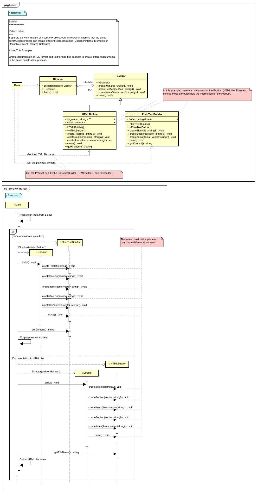</a><br><a href="https://github.com/takaakit/design-pattern-examples-in-cpp/tree/master/creational_patterns/builder">C++ Code</a><br><a href="./creational_patterns/builder/ExecutionResult.png">Execution Result</a> | <a href="https://htmlpreview.github.io/?https://github.com/takaakit/uml-diagram-for-cpp-design-pattern-examples/blob/master/creational_patterns/factory_method/DiagramMap.html">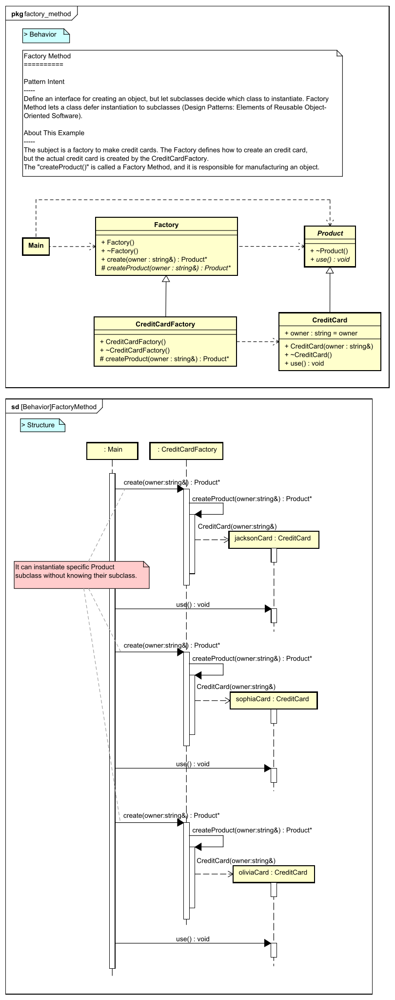</a><br><a href="https://github.com/takaakit/design-pattern-examples-in-cpp/tree/master/creational_patterns/factory_method">C++ Code</a><br><a href="./creational_patterns/factory_method/ExecutionResult.png">Execution Result</a> |
| **Prototype** | **Singleton** |  |
| <a href="https://htmlpreview.github.io/?https://github.com/takaakit/uml-diagram-for-cpp-design-pattern-examples/blob/master/creational_patterns/prototype/DiagramMap.html">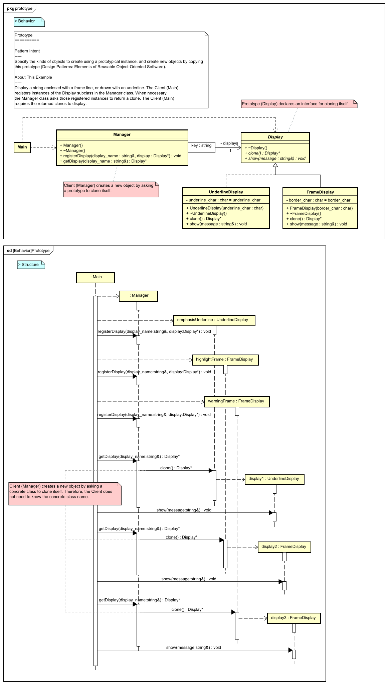</a><br><a href="https://github.com/takaakit/design-pattern-examples-in-cpp/tree/master/creational_patterns/prototype">C++ Code</a><br><a href="./creational_patterns/prototype/ExecutionResult.png">Execution Result</a> | <a href="https://htmlpreview.github.io/?https://github.com/takaakit/uml-diagram-for-cpp-design-pattern-examples/blob/master/creational_patterns/singleton/DiagramMap.html">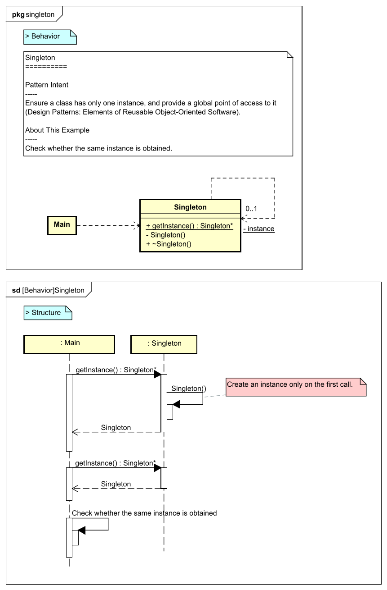</a><br><a href="https://github.com/takaakit/design-pattern-examples-in-cpp/tree/master/creational_patterns/singleton">C++ Code</a><br><a href="./creational_patterns/singleton/ExecutionResult.png">Execution Result</a> |  |

Structural Patterns
---
|  |  |  |
| :---: | :---: | :---: |
| **Adapter** | **Bridge** | **Composite** |
| <a href="https://htmlpreview.github.io/?https://github.com/takaakit/uml-diagram-for-cpp-design-pattern-examples/blob/master/structural_patterns/adapter/DiagramMap.html">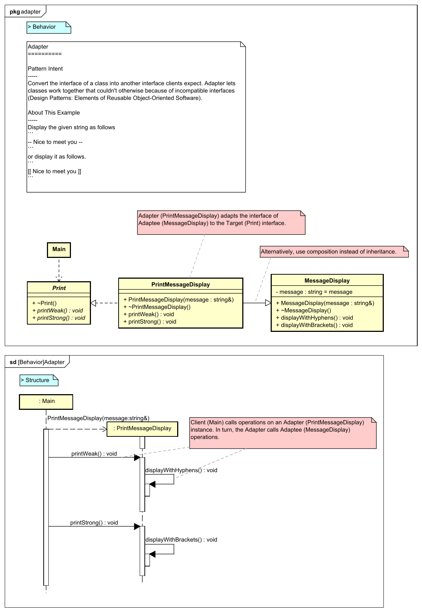</a><br><a href="https://github.com/takaakit/design-pattern-examples-in-cpp/tree/master/structural_patterns/adapter">C++ Code</a><br><a href="./structural_patterns/adapter/ExecutionResult.png">Execution Result</a> | <a href="https://htmlpreview.github.io/?https://github.com/takaakit/uml-diagram-for-cpp-design-pattern-examples/blob/master/structural_patterns/bridge/DiagramMap.html">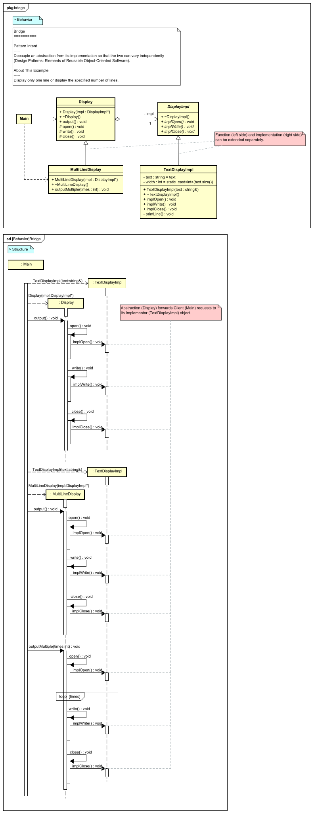</a><br><a href="https://github.com/takaakit/design-pattern-examples-in-cpp/tree/master/structural_patterns/bridge">C++ Code</a><br><a href="./structural_patterns/bridge/ExecutionResult.png">Execution Result</a> | <a href="https://htmlpreview.github.io/?https://github.com/takaakit/uml-diagram-for-cpp-design-pattern-examples/blob/master/structural_patterns/composite/DiagramMap.html">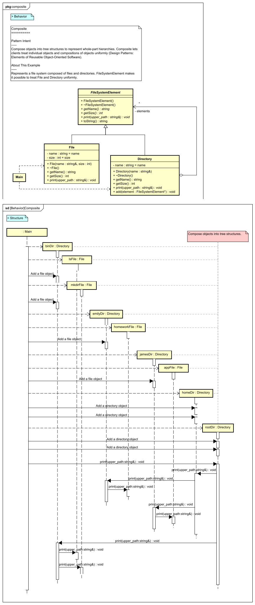</a><br><a href="https://github.com/takaakit/design-pattern-examples-in-cpp/tree/master/structural_patterns/composite">C++ Code</a><br><a href="./structural_patterns/composite/ExecutionResult.png">Execution Result</a> |
| **Decorator** | **Facade** | **Flyweight** |
| <a href="https://htmlpreview.github.io/?https://github.com/takaakit/uml-diagram-for-cpp-design-pattern-examples/blob/master/structural_patterns/decorator/DiagramMap.html">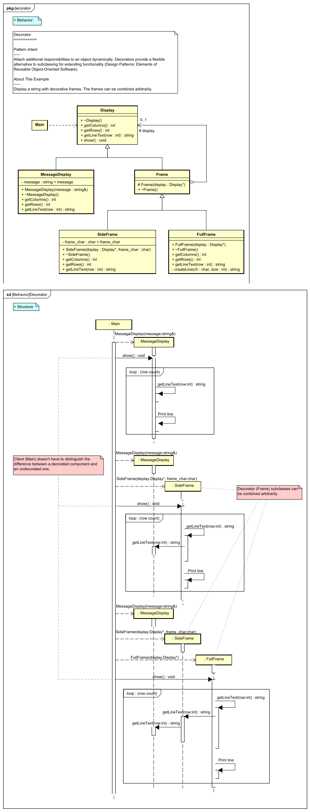</a><br><a href="https://github.com/takaakit/design-pattern-examples-in-cpp/tree/master/structural_patterns/decorator">C++ Code</a><br><a href="./structural_patterns/decorator/ExecutionResult.png">Execution Result</a> | <a href="https://htmlpreview.github.io/?https://github.com/takaakit/uml-diagram-for-cpp-design-pattern-examples/blob/master/structural_patterns/facade/DiagramMap.html">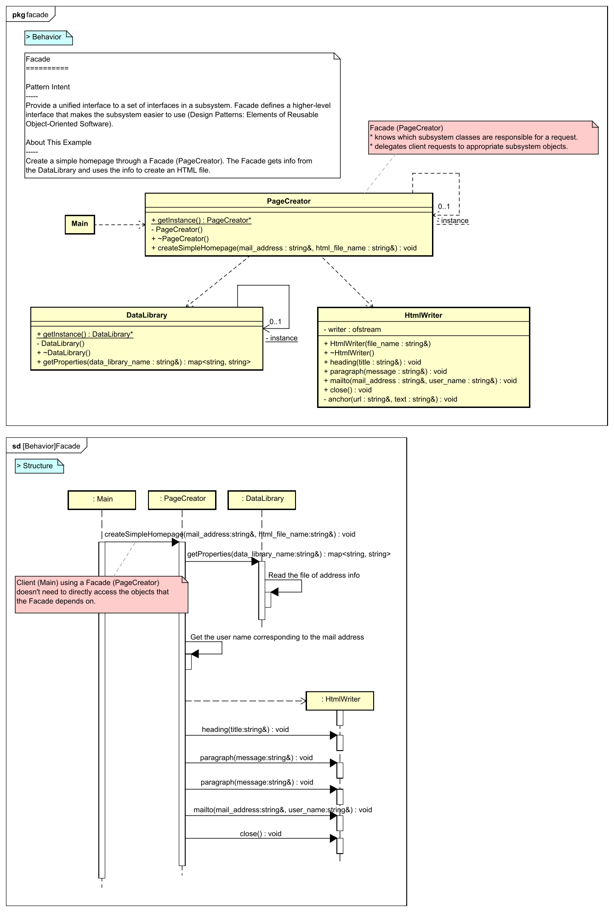</a><br><a href="https://github.com/takaakit/design-pattern-examples-in-cpp/tree/master/structural_patterns/facade">C++ Code</a><br><a href="./structural_patterns/facade/ExecutionResult.png">Execution Result</a> | <a href="https://htmlpreview.github.io/?https://github.com/takaakit/uml-diagram-for-cpp-design-pattern-examples/blob/master/structural_patterns/flyweight/DiagramMap.html">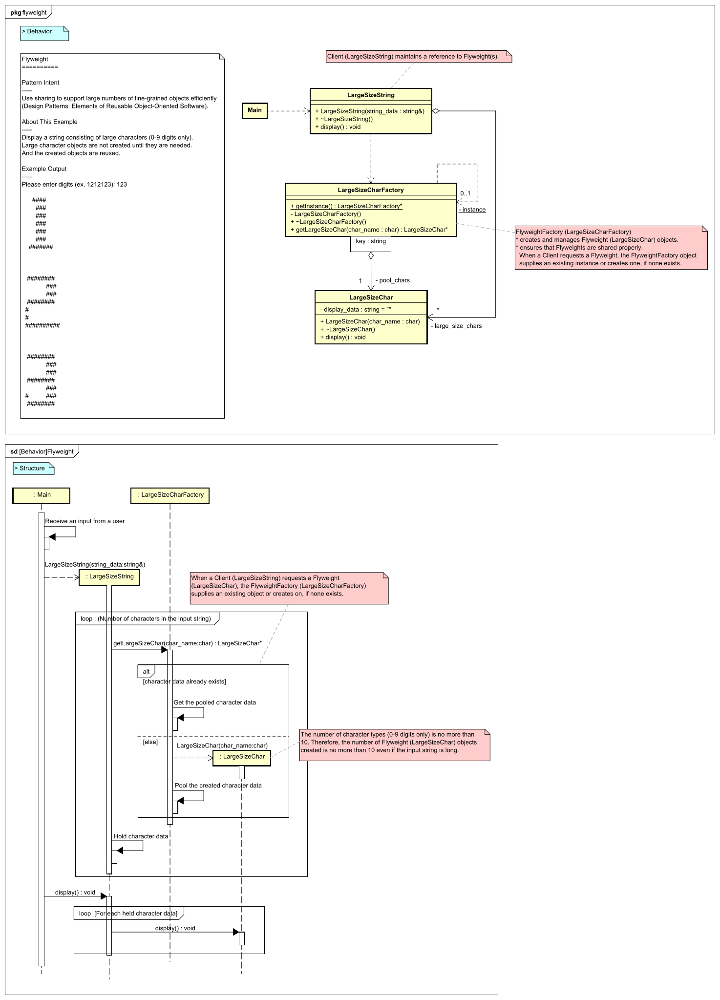</a><br><a href="https://github.com/takaakit/design-pattern-examples-in-cpp/tree/master/structural_patterns/flyweight">C++ Code</a><br><a href="./structural_patterns/flyweight/ExecutionResult.png">Execution Result</a> |
| **Proxy** |  |  |
| <a href="https://htmlpreview.github.io/?https://github.com/takaakit/uml-diagram-for-cpp-design-pattern-examples/blob/master/structural_patterns/proxy/DiagramMap.html">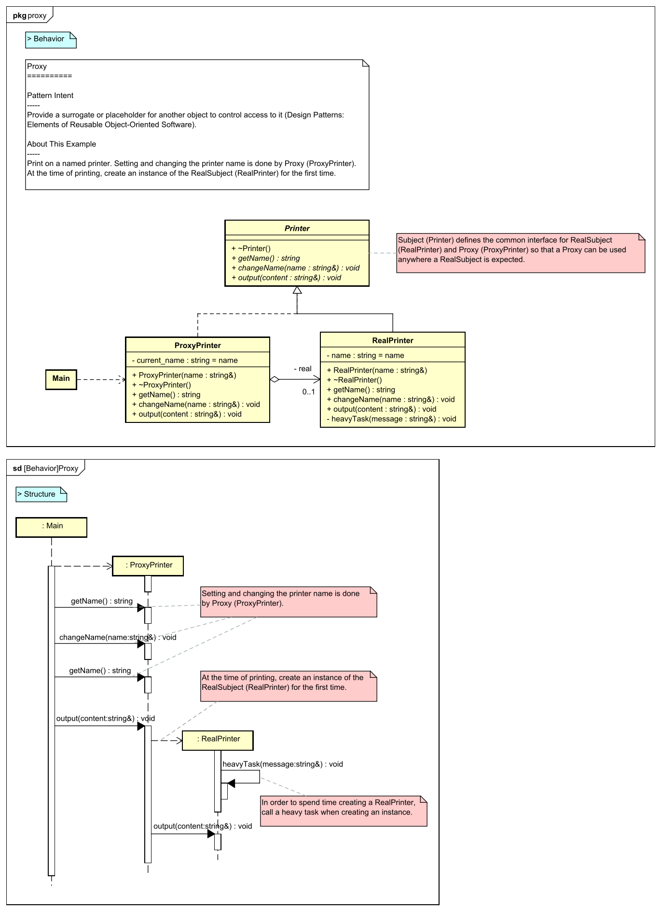</a><br><a href="https://github.com/takaakit/design-pattern-examples-in-cpp/tree/master/structural_patterns/proxy">C++ Code</a><br><a href="./structural_patterns/proxy/ExecutionResult.png">Execution Result</a> | | |

[](https://raw.githubusercontent.com/takaakit/design-pattern-examples-in-cpp/master/screenshots/DiagramMap.svg)

Design Pattern Examples in C++
===

Model and code examples of GoF Design Patterns for C++.  
This project is available for the following objectives:  

* To try Model-Driven Development (MDD) using Astah and M PLUS plug-in.
* To understand the mapping between UML model and C++ code.
* To understand GoF Design Pattern examples in C++.  
  etc.

> UML model example:


> C++ header file example:

```cpp:File class
// ˅

// ˄

#ifndef STRUCTURAL_PATTERNS_COMPOSITE_FILE_H_
#define STRUCTURAL_PATTERNS_COMPOSITE_FILE_H_

// ˅
#include <string>
#include "structural_patterns/composite/FileSystemElement.h"

using namespace std;

// ˄

class File : public FileSystemElement
{
	// ˅
	
	// ˄

private:

	const string name;

	const int size;

public:

	File(const string& name, const int size);

	~File();

	const string getName() const;

	const int getSize() const;

	// Print this element with the "upper_path".
	void print(const string& upper_path) const;

	// ˅
public:
	
protected:
	
private:
	File(const File&) = delete;
	File& operator=(const File&) = delete;
	
	// ˄
};

// ˅

// ˄

#endif	// STRUCTURAL_PATTERNS_COMPOSITE_FILE_H_

// ˅

// ˄
```

> C++ source file example:

```cpp:File class
// ˅
#include <iostream>
#include "structural_patterns/composite/File.h"

using namespace std;

// ˄

File::File(const string& name, const int size)
	: name(name)
	, size(size)
	// ˅
    
	// ˄
{
	// ˅
	
	// ˄
}

File::~File()
{
	// ˅
	
	// ˄
}

const string File::getName() const
{
	// ˅
	return name;
	// ˄
}

const int File::getSize() const
{
	// ˅
	return size;
	// ˄
}

void File::print(const string& upper_path) const
{
	// ˅
	cout << upper_path << "/" << toString() << endl;
	// ˄
}

// ˅

// ˄
```

Installation
------------

**Astah**

* Download Astah UML or Professional from [Change Vision site](http://astah.net/download), and install.  

**M PLUS plug-in**

* Download the plug-in from [M PLUS plug-in site](https://sites.google.com/view/m-plus-plugin/download), and install.  
  Use **ver.2.2** or higher.

**Visual Studio IDE**

* Download and install [Visual Studio IDE](https://visualstudio.microsoft.com/vs/).  
  Check "**Desktop development with C++**" and "**C++/CLI support**" when installing.
* Microsoft .NET Framework **4.7.2** or higher is required.

Usage
-----

* Select model elements on the model browser of Astah, and press the "Generate code" button to generate.  
* The generated code has "User Code Area". The "User Code Area" is the area enclosed by "˅" and "˄". Handwritten code written in the "User Code Area" remains after a re-generation.
* Set up a startup project in Visual Studio, build and run it.
* For detailed usage of the tools, please see [Astah Manual](http://astah.net/manual) and [M PLUS plug-in Tips](https://sites.google.com/view/m-plus-plugin-tips).


References
----------

* Gamma, E. et al. Design Patterns: Elements of Reusable Object-Oriented Software, Addison-Wesley, 1994
* Hiroshi Yuki. Learning Design Patterns in Java [In Japanese Language], Softbank publishing, 2004

Licence
-------

This project is licensed under the Creative Commons Zero (CC0) license. The model and code are completely free to use.

[](http://creativecommons.org/publicdomain/zero/1.0/deed)

References
---

* Gamma, E. et al. Design Patterns: Elements of Reusable Object-Oriented Software, Addison-Wesley, 1994
* Hiroshi Yuki. Learning Design Patterns in Java [In Japanese Language], Softbank publishing, 2004

Links
---
* [Design Pattern Examples in C++](https://github.com/takaakit/design-pattern-examples-in-cpp)
* [Diagram Map: tracing UML/SysML elements across diagrams](https://dev.to/takaakit/diagram-map-tracing-uml-sysml-elements-across-diagrams-49i7)

Licence
---
Diagram Map file (DiagramMap.html) includes the following libraries:
* [D3 library](https://d3js.org) is copyrighted by Mike Bostock and is released under the [BSD license](https://opensource.org/licenses/BSD-3-Clause).
* [Popper library](https://popper.js.org/) is copyrighted by Federico Zivolo and is released under the [MIT license](https://opensource.org/licenses/MIT).
* [Tippy library](https://atomiks.github.io/tippyjs/) is copyrighted by atomiks and is released under the [MIT license](https://opensource.org/licenses/MIT).

Files and data in this project other than the above libraries are under the [Creative Commons Zero (CC0) license](https://creativecommons.org/publicdomain/zero/1.0/).

