# Design Patterns Overview 

## Pattern Classes

|                 | Creational Pattern                                           | Structural Pattern                                           | Behavioral Pattern                                           |
| --------------- | ------------------------------------------------------------ | ------------------------------------------------------------ | ------------------------------------------------------------ |
| **Description** | Provides object creation mechanisms, which increase flexibility and reuse of existing code. | Explain how to assemble objects and classes into larger structures while keeping these structures flexible and efficient. | Concerned with algorithms and the assignment of responsibilities between objects. |

## Creational Patterns

| ID   | Name                                                         | Description                                                  | Visualization                                                |
| ---- | ------------------------------------------------------------ | ------------------------------------------------------------ | ------------------------------------------------------------ |
| 1    | [Factory Method](https://refactoring.guru/design-patterns/factory-method) | Provides an interface for creating objects in a superclass, but allows subclasses to alter the type of objects that will be created. |  |
| 2    | [Abstract Factory](https://refactoring.guru/design-patterns/abstract-factory) | Lets you produce families of related objects without specifying their concrete classes. |  |
| 3    | [Builder](https://refactoring.guru/design-patterns/builder)  | Lets you construct complex objects step by step. The pattern allows you to produce different types and representations of an object using the same construction code. |  |
| 4    | [Singleton](https://refactoring.guru/design-patterns/singleton) | Lets you ensure that a class has only one instance while providing a global access point to this instance. |  |
| 5    | [Prototype](https://refactoring.guru/design-patterns/prototype) | Lets you copy existing objects without making your code dependent on their classes. |  |

## Structural Patterns

| ID   | Name                                                         | Description                                                  | Visualization                                                |
| ---- | ------------------------------------------------------------ | ------------------------------------------------------------ | ------------------------------------------------------------ |
| 1    | [Adapter](https://refactoring.guru/design-patterns/adapter)  | Allows objects with incompatible interfaces to collaborate.  |  |
| 2    | [Bridge](https://refactoring.guru/design-patterns/bridge)    | Lets you split a large class or a set of closely related classes into two separate hierarchies - abstraction and implementation - which can be developed independently of each other. |  |
| 3    | [Composite](https://refactoring.guru/design-patterns/composite) | Lets you compose objects into tree structures and then work with these structures as if they were individual objects. |  |
| 4    | [Decorator](https://refactoring.guru/design-patterns/decorator) | Lets you attach new behaviors to objects by placing these objects inside special wrapper objects that contain the behaviors. |  |
| 5    | [Facade](https://refactoring.guru/design-patterns/facade)    | Provides a simplified interface to a library, a framework, or any other complex set of classes. |  |
| 6    | [Flyweight](https://refactoring.guru/design-patterns/flyweight) | Lets you fit more objects into the available amount of RAM by sharing common parts of state between multiple objects instead of keeping all of the data in each object. |  |
| 7    | [Proxy](https://refactoring.guru/design-patterns/proxy)      | Lets you provide a substitute or placeholder for another object. A proxy controls access to the original object, allowing you to perform something either before or after the request gets through to the original object. |  |

## Behavioral Patterns

| ID   | Name                                                         | Description                                                  | Visualization                                                |
| ---- | ------------------------------------------------------------ | ------------------------------------------------------------ | ------------------------------------------------------------ |
| 1    | [Chain of Responsibility](https://refactoring.guru/design-patterns/chain-of-responsibility) | Lets you pass requests along a chain of handlers. Upon receiving a request, each handler decides either to process the request or to pass it to the next handler in the chain. |  |
| 2    | [Command](https://refactoring.guru/design-patterns/command)  | Turns a request into a standalone object that contains all info about the request. This transformation lets you pass requests as method arguments, delay or queue a request's execution, and support undoable operations. |  |
| 3    | [Iterator](https://refactoring.guru/design-patterns/iterator) | Lets you traverse elements of a collection without exposing its underlying representation (list, stack, tree, etc.). |  |
| 4    | [Mediator](https://refactoring.guru/design-patterns/mediator) | Lets you reduce chaotic dependencies between objects. The pattern restricts direct communication between the objects and forces them to collaborate only via a mediator object. |  |
| 5    | [Memento](https://refactoring.guru/design-patterns/memento)  | Lets you save and restore previous state of an object without revealing the details of its implementation. |  |
| 6    | [Observer](https://refactoring.guru/design-patterns/observer) | Lets you define a subscription mechanism to notify multiple objects about any events that happen to the object they're observing. |  |
| 7    | [State](https://refactoring.guru/design-patterns/state)      | Lets an object alter its behavior when its internal state changes. It appears as if the object changed its class. |  |
| 8    | [Strategy](https://refactoring.guru/design-patterns/strategy) | Lets you define a family of algorithms, put each of them into a separate class, and make their objects interchangeable. |  |
| 9    | [Template Method](https://refactoring.guru/design-patterns/template-method) | Defines a skeleton of an algorithm in the superclass but lets subclasses override specific steps of the algorithm without changing its structure. |  |
| 10   | [Visitor](https://refactoring.guru/design-patterns/visitor)  | Lets you separate algorithms from the objects on which they operate. |  |

UML Diagram for Python Design Pattern Examples
===

This project lists UML diagrams of the "[Design Pattern Examples in Python](https://github.com/ploukareas/Design-Patterns)". When you click on a diagram image, the diagram will be opened in **Diagram Map**. If you want to know about Diagram Map, see [this post](https://dev.to/takaakit/diagram-map-tracing-uml-sysml-elements-across-diagrams-49i7).

Creational Patterns
---

|                                                              |                                                              |                                                              |
| :----------------------------------------------------------: | :----------------------------------------------------------: | :----------------------------------------------------------: |
|                   **1. Abstract Factory**                    |                        **2. Builder**                        |                    **3. Factory Method**                     |
| <a href="https://htmlpreview.github.io/?https://github.com/ploukareas/Design-Patterns/blob/master/Python/creational_patterns/abstract_factory/DiagramMap.html">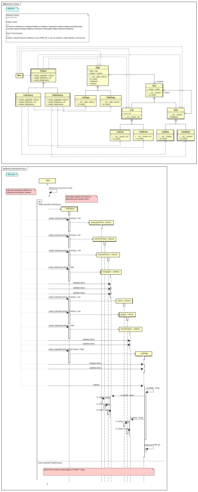</a> <a href="https://github.com/ploukareas/Design-Patterns/tree/master/Python/creational_patterns/abstract_factory/main.py">Python Code</a> 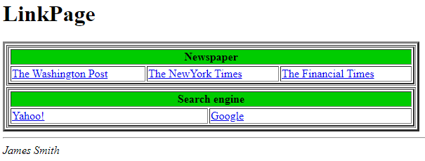 | <a href="https://htmlpreview.github.io/?https://github.com/ploukareas/Design-Patterns/blob/master/Python/creational_patterns/builder/DiagramMap.html">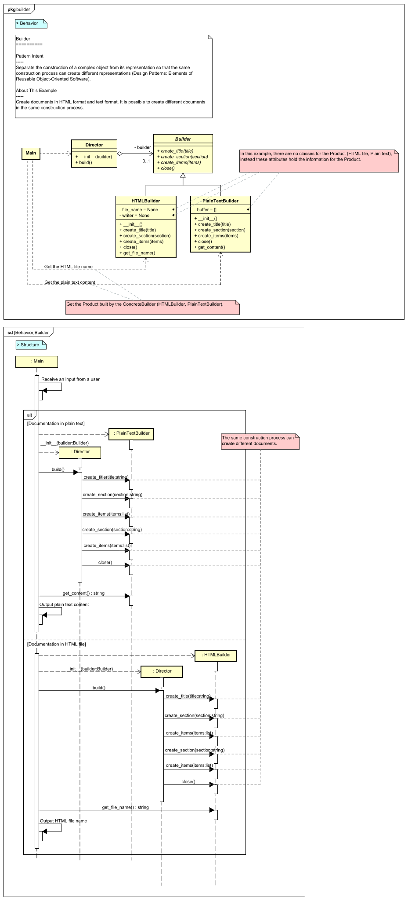</a> <a href="https://github.com/ploukareas/Design-Patterns/tree/master/Python/creational_patterns/builder/main.py">Python Code</a> 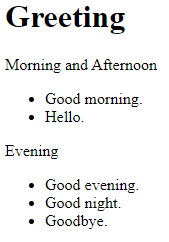 | <a href="https://htmlpreview.github.io/?https://github.com/ploukareas/Design-Patterns/blob/master/Python/creational_patterns/factory_method/DiagramMap.html">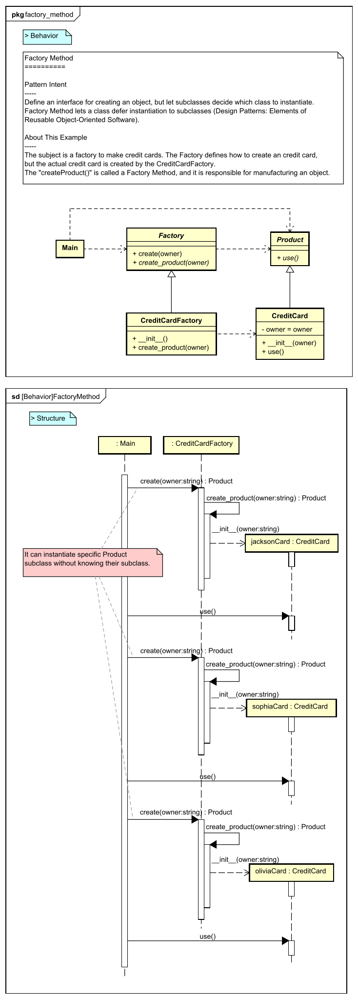</a> <a href="https://github.com/ploukareas/Design-Patterns/tree/master/Python/creational_patterns/factory_method/main.py">Python Code</a> 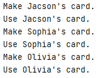 |
|                       **4. Prototype**                       |                       **5. Singleton**                       |                                                              |
| <a href="https://htmlpreview.github.io/?https://github.com/ploukareas/Design-Patterns/blob/master/Python/creational_patterns/prototype/DiagramMap.html">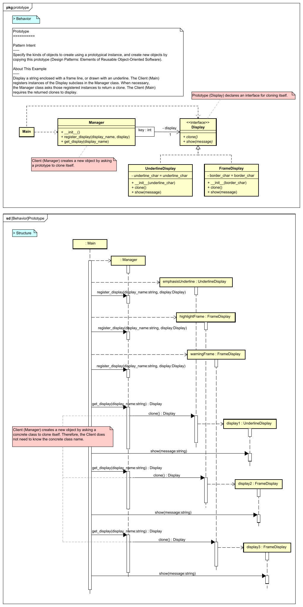</a> <a href="https://github.com/ploukareas/Design-Patterns/tree/master/Python/creational_patterns/prototype/main.py">Python Code</a> 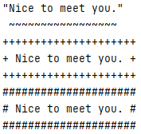 | <a href="https://htmlpreview.github.io/?https://github.com/ploukareas/Design-Patterns/blob/master/Python/creational_patterns/singleton/DiagramMap.html">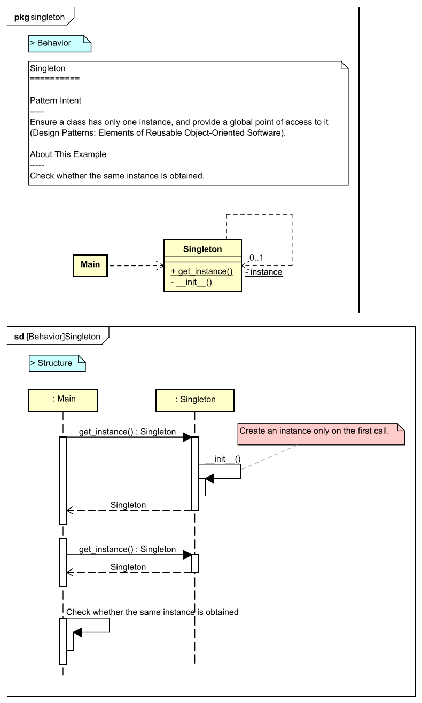</a> <a href="https://github.com/ploukareas/Design-Patterns/tree/master/Python/creational_patterns/singleton/main.py">Python Code</a> 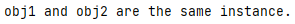 |                                                              |

Structural Patterns
---

|                                                              |                                                              |                                                              |
| :----------------------------------------------------------: | :----------------------------------------------------------: | :----------------------------------------------------------: |
|                        **1. Adapter**                        |                        **2. Bridge**                         |                       **3. Composite**                       |
| <a href="https://htmlpreview.github.io/?https://github.com/ploukareas/Design-Patterns/blob/master/Python/structural_patterns/adapter/DiagramMap.html">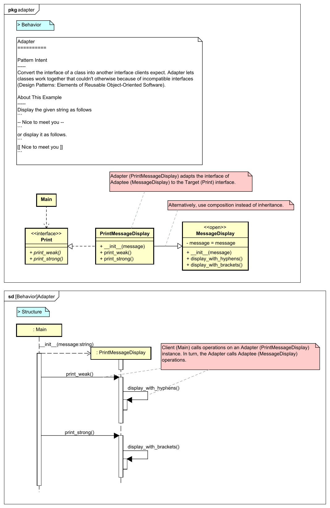</a> <a href="https://github.com/ploukareas/Design-Patterns/tree/master/Python/structural_patterns/adapter/main.py">Python Code</a> 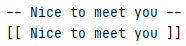 | <a href="https://htmlpreview.github.io/?https://github.com/ploukareas/Design-Patterns/blob/master/Python/structural_patterns/bridge/DiagramMap.html">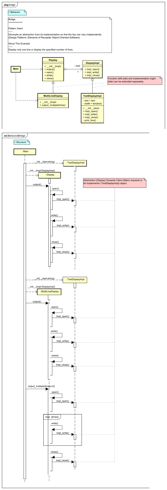</a> <a href="https://github.com/ploukareas/Design-Patterns/tree/master/Python/structural_patterns/bridge/main.py">Python Code</a> 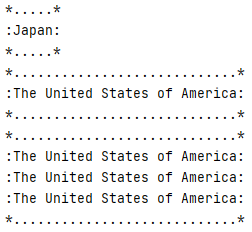 | <a href="https://htmlpreview.github.io/?https://github.com/ploukareas/Design-Patterns/blob/master/Python/structural_patterns/composite/DiagramMap.html">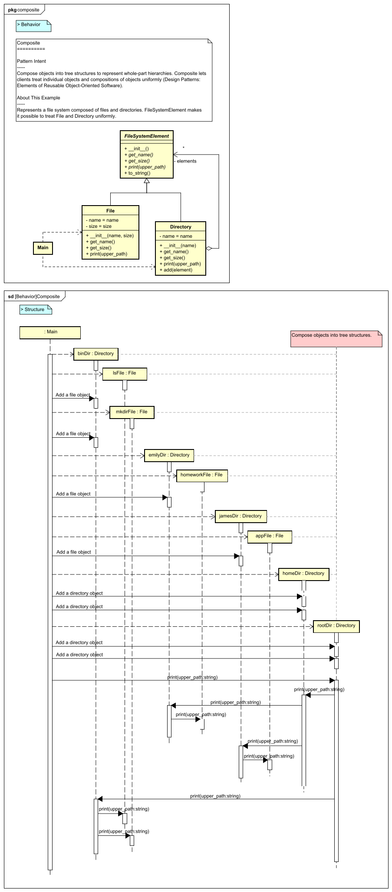</a> <a href="https://github.com/ploukareas/Design-Patterns/tree/master/Python/structural_patterns/composite/main.py">Python Code</a> 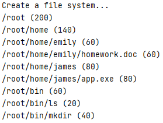 |
|                        **Decorator**                         |                          **Facade**                          |                        **Flyweight**                         |
| <a href="https://htmlpreview.github.io/?https://github.com/ploukareas/Design-Patterns/blob/master/Python/structural_patterns/decorator/DiagramMap.html">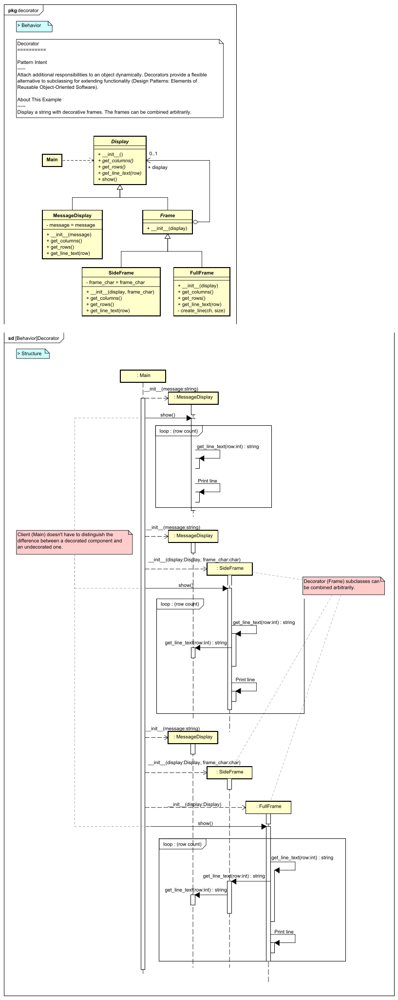</a> <a href="https://github.com/ploukareas/Design-Patterns/tree/master/Python/structural_patterns/decorator/main.py">Python Code</a> 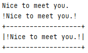 | <a href="https://htmlpreview.github.io/?https://github.com/ploukareas/Design-Patterns/blob/master/Python/structural_patterns/facade/DiagramMap.html">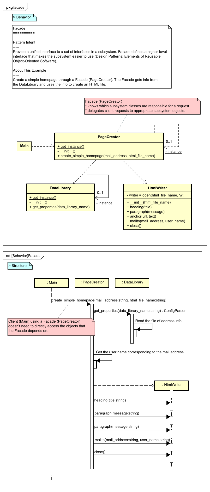</a> <a href="https://github.com/ploukareas/Design-Patterns/tree/master/Python/structural_patterns/facade/main.py">Python Code</a> 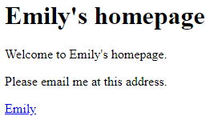 | <a href="https://htmlpreview.github.io/?https://github.com/ploukareas/Design-Patterns/blob/master/Python/structural_patterns/flyweight/DiagramMap.html">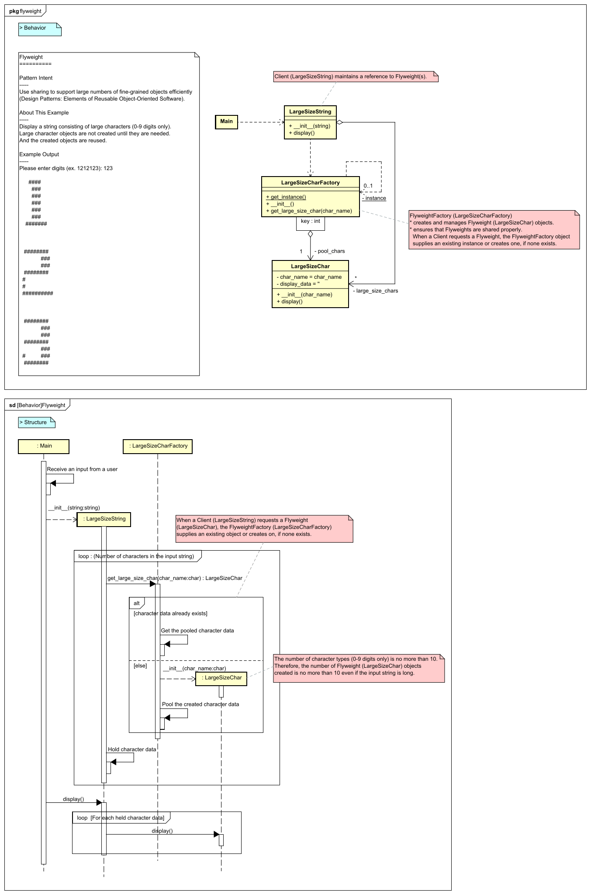</a> <a href="https://github.com/ploukareas/Design-Patterns/tree/master/Python/structural_patterns/flyweight/main.py">Python Code</a> 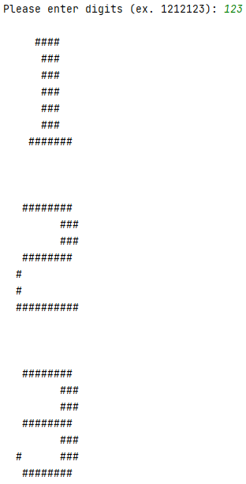 |
|                          **Proxy**                           |                                                              |                                                              |
| <a href="https://htmlpreview.github.io/?https://github.com/ploukareas/Design-Patterns/blob/master/Python/structural_patterns/proxy/DiagramMap.html">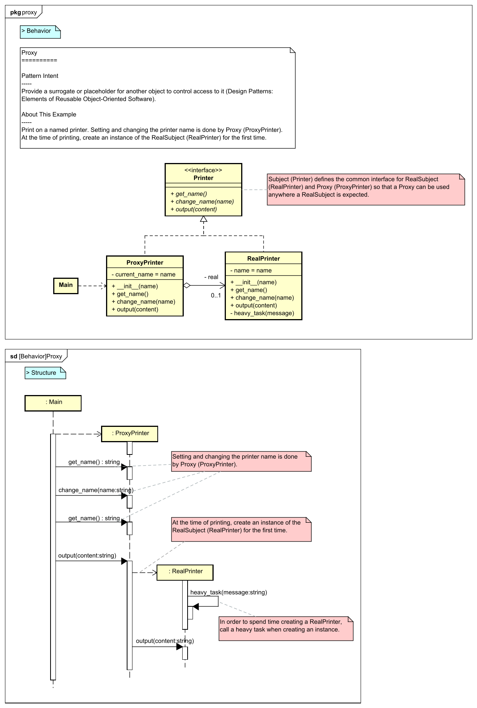</a> <a href="https://github.com/ploukareas/Design-Patterns/tree/master/Python/structural_patterns/proxy/main.py">Python Code</a> 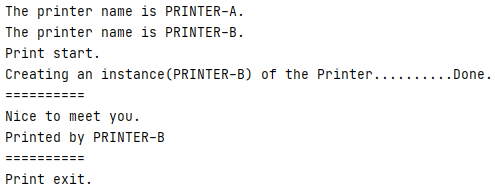 |                                                              |                                                              |

Behavioral Patterns
---

|                                                              |                                                              |                                                              |
| :----------------------------------------------------------: | :----------------------------------------------------------: | :----------------------------------------------------------: |
|                **1. Chain of Responsibility**                |                        **2. Command**                        |                      **3. Interpreter**                      |
| <a href="https://htmlpreview.github.io/?https://github.com/ploukareas/Design-Patterns/blob/master/Python/behavioral_patterns/chain_of_responsibility/DiagramMap.html">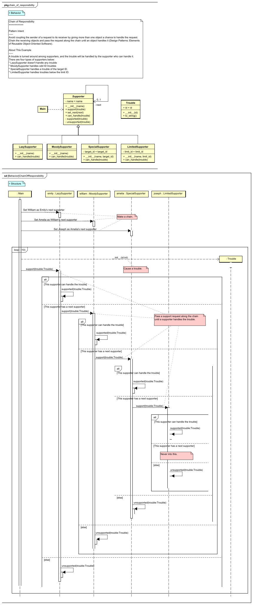</a> <a href="https://github.com/ploukareas/Design-Patterns/tree/master/Python/behavioral_patterns/chain_of_responsibility/main.py">Python Code</a> 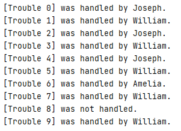 | <a href="https://htmlpreview.github.io/?https://github.com/ploukareas/Design-Patterns/blob/master/Python/behavioral_patterns/command/DiagramMap.html">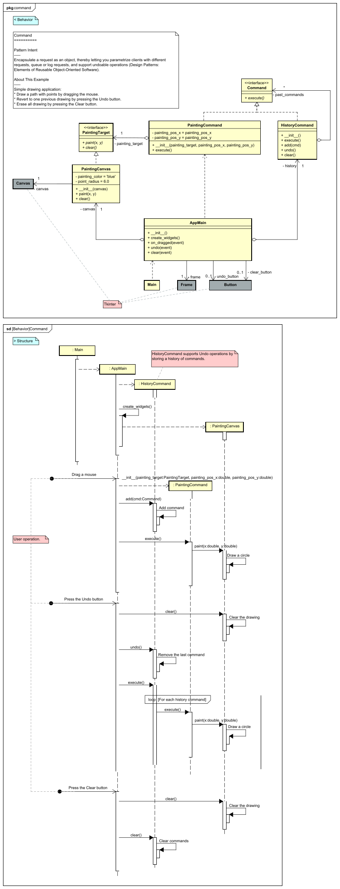</a> <a href="https://github.com/ploukareas/Design-Patterns/tree/master/Python/behavioral_patterns/command/main.py">Python Code</a> 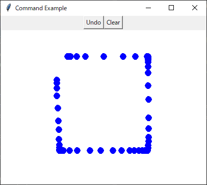 | <a href="https://htmlpreview.github.io/?https://github.com/ploukareas/Design-Patterns/blob/master/Python/behavioral_patterns/interpreter/DiagramMap.html">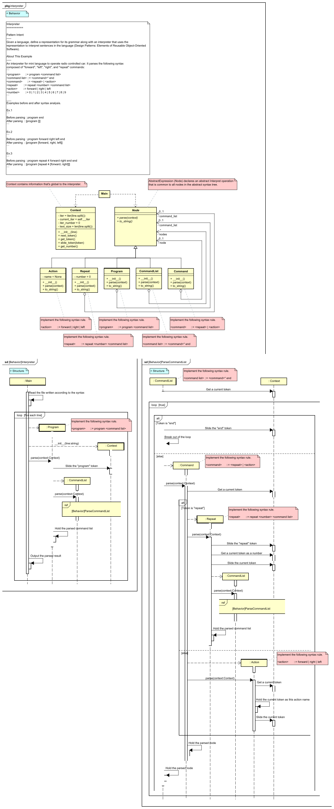</a> <a href="https://github.com/ploukareas/Design-Patterns/tree/master/Python/behavioral_patterns/interpreter/main.py">Python Code</a> 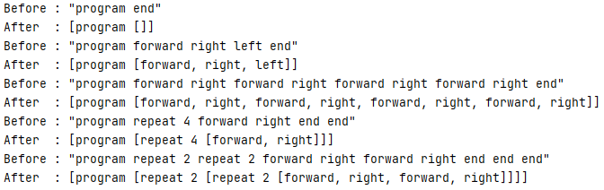 |
|                       **4. Iterator**                        |                       **5. Mediator**                        |                        **6. Memento**                        |
| <a href="https://htmlpreview.github.io/?https://github.com/ploukareas/Design-Patterns/blob/master/Python/behavioral_patterns/iterator/DiagramMap.html">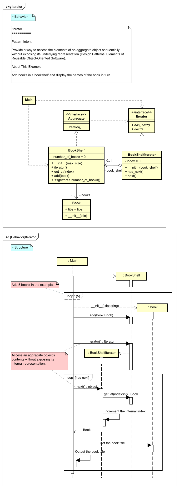</a> <a href="https://github.com/ploukareas/Design-Patterns/tree/master/Python/behavioral_patterns/iterator/main.py">Python Code</a> 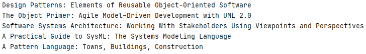 | <a href="https://htmlpreview.github.io/?https://github.com/ploukareas/Design-Patterns/blob/master/Python/behavioral_patterns/mediator/DiagramMap.html">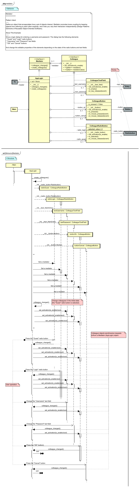</a> <a href="https://github.com/ploukareas/Design-Patterns/tree/master/Python/behavioral_patterns/mediator/main.py">Python Code</a> 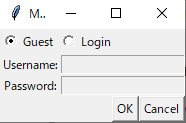 | <a href="https://htmlpreview.github.io/?https://github.com/ploukareas/Design-Patterns/blob/master/Python/behavioral_patterns/memento/DiagramMap.html">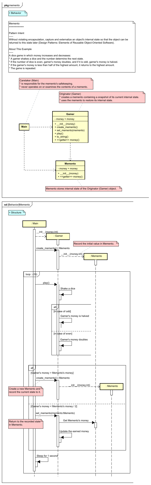</a> <a href="https://github.com/ploukareas/Design-Patterns/tree/master/Python/behavioral_patterns/memento/main.py">Python Code</a> 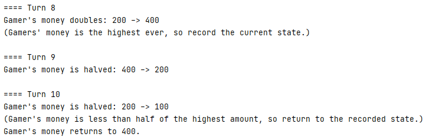 |
|                       **7. Observer**                        |                         **8. State**                         |                       **9. Strategy**                        |
| <a href="https://htmlpreview.github.io/?https://github.com/ploukareas/Design-Patterns/blob/master/Python/behavioral_patterns/observer/DiagramMap.html">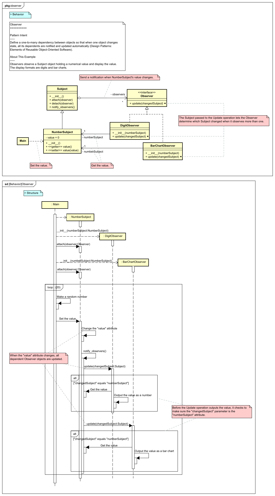</a> <a href="https://github.com/ploukareas/Design-Patterns/tree/master/Python/behavioral_patterns/observer/main.py">Python Code</a> 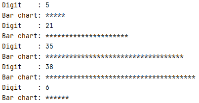 | <a href="https://htmlpreview.github.io/?https://github.com/ploukareas/Design-Patterns/blob/master/Python/behavioral_patterns/state/DiagramMap.html">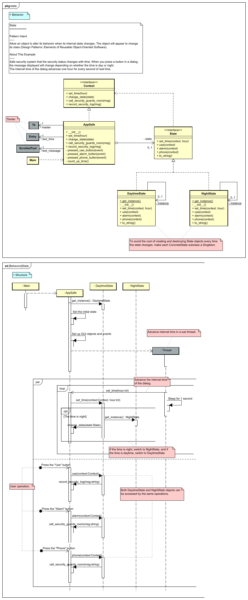</a> <a href="https://github.com/ploukareas/Design-Patterns/tree/master/Python/behavioral_patterns/state/main.py">Python Code</a> 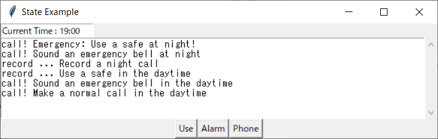 | <a href="https://htmlpreview.github.io/?https://github.com/ploukareas/Design-Patterns/blob/master/Python/behavioral_patterns/strategy/DiagramMap.html">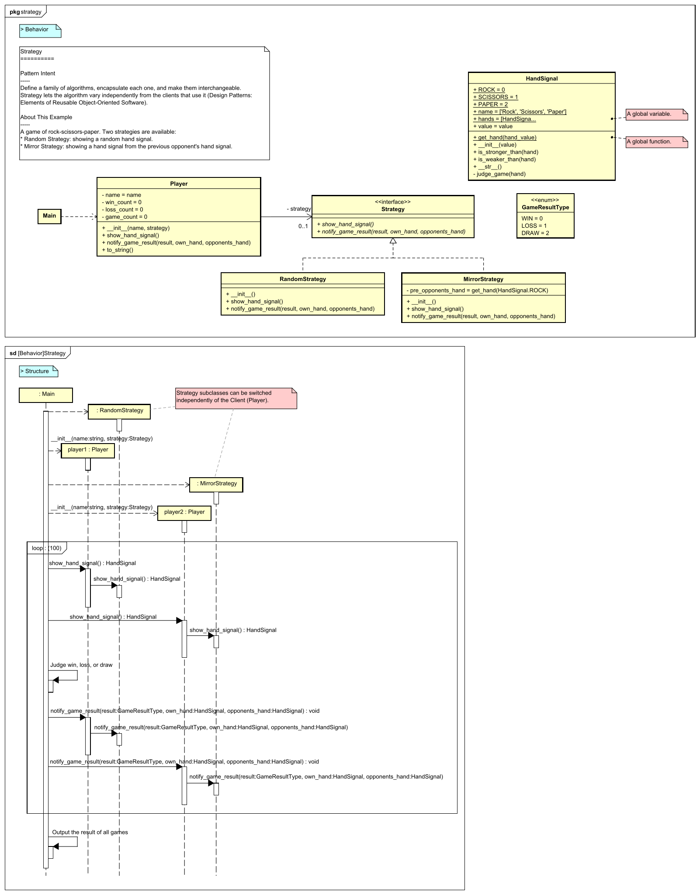</a> <a href="https://github.com/ploukareas/Design-Patterns/tree/master/Python/behavioral_patterns/strategy/main.py">Python Code</a> 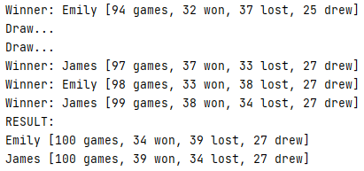 |
|                   **10. Template Method**                    |                       **11. Visitor**                        |                                                              |
| <a href="https://htmlpreview.github.io/?https://github.com/ploukareas/Design-Patterns/blob/master/Python/behavioral_patterns/template_method/DiagramMap.html">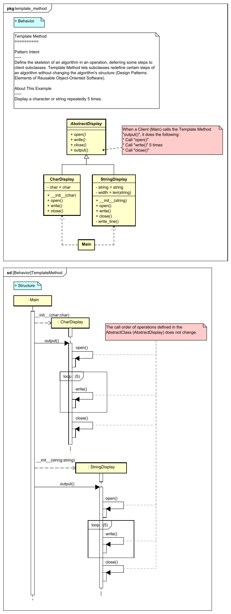</a> <a href="https://github.com/ploukareas/Design-Patterns/tree/master/Python/behavioral_patterns/template_method/main.py">Python Code</a> 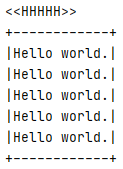 | <a href="https://htmlpreview.github.io/?https://github.com/ploukareas/Design-Patterns/blob/master/Python/behavioral_patterns/visitor/DiagramMap.html">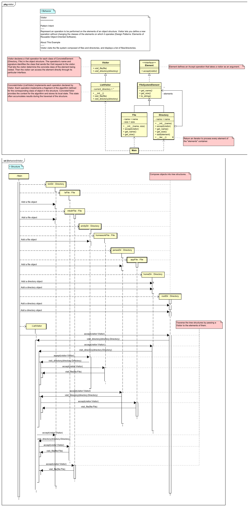</a> <a href="https://github.com/ploukareas/Design-Patterns/tree/master/Python/behavioral_patterns/visitor/main.py">Python Code</a> 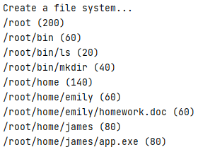 |                                                              |

References
---

* Gamma, E. et al. Design Patterns: Elements of Reusable Object-Oriented Software, Addison-Wesley, 1994
* Hiroshi Yuki. Learning Design Patterns in Java [In Japanese Language], Softbank publishing, 2004

Links
---

* [Design Pattern Examples in Python](https://github.com/ploukareas/Design-Patterns)
* [Diagram Map: tracing UML/SysML elements across diagrams](https://dev.to/takaakit/diagram-map-tracing-uml-sysml-elements-across-diagrams-49i7)

License
---

Diagram Map file (DiagramMap.html) includes the following libraries:

* [D3 library](https://d3js.org) is copyrighted by Mike Bostock and is released under the [BSD license](https://opensource.org/licenses/BSD-3-Clause).
* [Popper library](https://popper.js.org/) is copyrighted by Federico Zivolo and is released under the [MIT license](https://opensource.org/licenses/MIT).
* [Tippy library](https://atomiks.github.io/tippyjs/) is copyrighted by atomiks and is released under the [MIT license](https://opensource.org/licenses/MIT).
